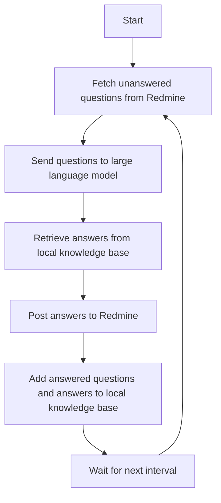

# About

This project is for redmine issues auto reply by using a local knowleage database.

# How it works



## Components Redmine Integration

1. **Redmine Integration**
   
   - Periodically fetch unanswered questions from Redmine.
   - Post answers back to Redmine.

2. **Large Language Model (LLM) Integration**
   
   - Send unanswered questions to the LLM.
   - Retrieve answers from the LLM based on the local knowledge base.

3. **Local Knowledge Base Management**
   
   - Query the local knowledge base for answers.
   - Update the local knowledge base with new answered questions and their answers.

4. **Scheduler**
   
   - Manage the periodic fetching and processing of unanswered questions.

## Detailed Steps

1. **Fetch Unanswered Questions from Redmine**
   
   - Connect to the Redmine API.
   - Retrieve a list of questions that have not been answered.

2. **Send Questions to Large Language Model**
   
   - Format the questions appropriately.
   - Send the questions to the large language model (LLM).

3. **Retrieve Answers from Local Knowledge Base**
   
   - Query the local knowledge base using the LLM.
   - Fetch relevant information to answer the questions.

4. **Post Answers to Redmine**
   
   - Format the answers.
   - Post the answers back to Redmine via the Redmine API.

5. **Add Answered Questions and Answers to Local Knowledge Base**
   
   - Update the local knowledge base with the newly answered questions and their answers.

6. **Wait for Next Interval**
   
   - Wait for a predefined interval before repeating the process.

## Technologies Used

- **Redmine API**: For fetching and posting questions.
- **Langchain**: For integrating with the large language model.
- **Local Knowledge Base**: For storing and retrieving knowledge.
- **Python**: For scripting and automation.
- **Scheduler (e.g., Cron, APScheduler)**: For periodic execution.

# Usage

To set up this project, follow these steps:

1. Clone the repository:
   
   ```sh
   git clone https://github.com/Xianleewu/redminegpt
   cd redminegpt
   ```

2. Install the required dependencies:
   
   ```sh
   python3 -m pip install -r requirements.txt
   ```

3. Configure the Redmine and LLM API credentials in the `config.py` file.
   
   ```json
   redmine server
   
   REDMINE_SERVER = {
    "host": 'http://127.0.0.1:3000',
    "user": 'gptbot',
    "password": 'password',
   }
   
   # QAnything remote server
   
   QANYTHING_REMOTE_SERVER = {
    "app_key": '',
    "app_secret": '',
    "kb_id": '',
   }
   ```
   
   

4. Run the bot:
   
   ```sh
   python3 main.py
   ```

# Depoly with docker

TODO

# TODO

- [x] Connect with Redmine via REST API

- [x] Auto reply new issues

- [x] QAnythingRemote support

- [ ] Auto gen local database acording to redmine closed issues

- [ ] QAnythingLocal support

- [ ] LangchainChatChat support

- [ ] Dify support

# Contributing

If you would like to contribute to this project, please submit a pull request or open an issue on GitHub.

